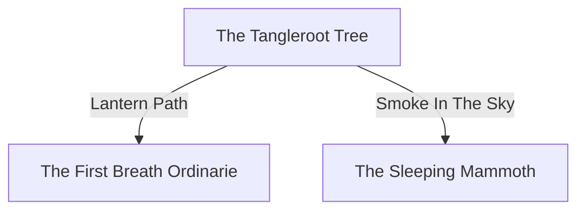

_District:_ [The Mound](/maps/districts/the-mound/)

This location is a \[mystical] \[ward] that \[functions as the hidden gateway to the Wyld].

* **District Tier:** Difficult ← _(1d8+2: [2]+2 = 4)_
* **Difficulty:** Normal ← _(1d6: [3] = 3)_
* **Level:** 4
* **Creature Type:** Monstrosity ← _(1d20: [19] = 19)_ 
## Locations

### The Tangleroot Tree

**The Tangleroot Tree** is a \[mystical] \[portal] that \[leads to the Wyld].

### The First Breath Ordinarie

**The First Breath Ordinarie** is a \[secret] \[gathering house] that \[provides food and lodging for those in need].
* Secret: \[A front for the Order of the First Breath]
